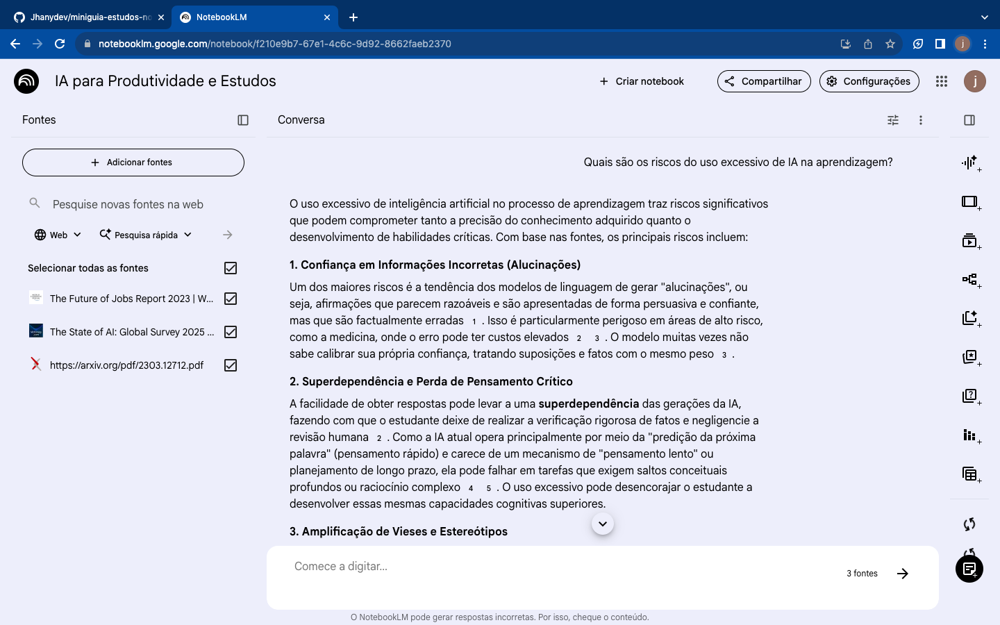
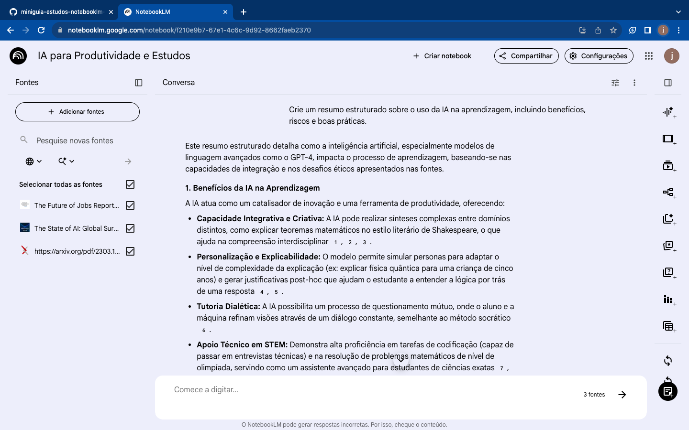
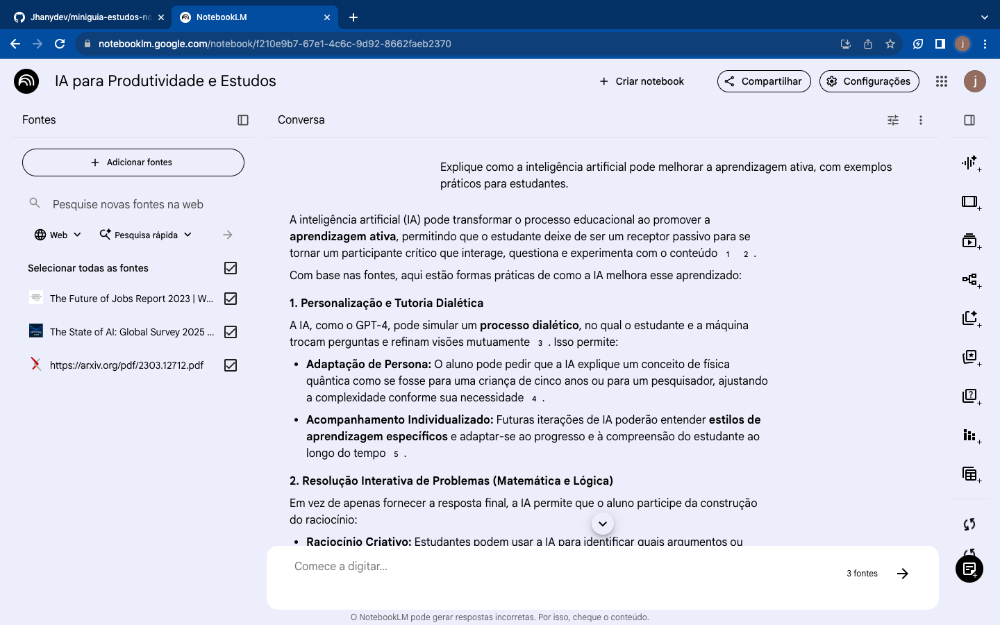
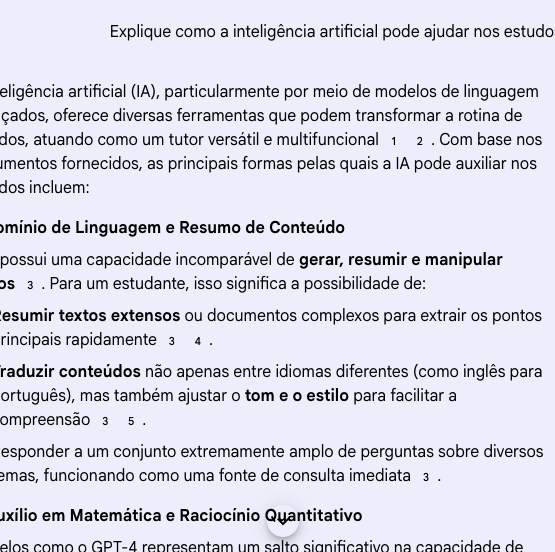

# 📚 Miniguia de Estudos com IA (NotebookLM)

## 🚀 Sobre o Projeto

Este projeto foi desenvolvido com o objetivo de explorar o uso da Inteligência Artificial como ferramenta de aprendizagem ativa.

Mais do que obter respostas, a proposta foi entender como interagir com IA de forma estratégica, aplicando:

* Curadoria de conteúdo
* Engenharia de prompts
* Pensamento crítico
* Organização do conhecimento

---

## 🎯 Tema

**Uso da Inteligência Artificial para produtividade e aprendizagem**

---

## 🎯 Objetivos

* Aprender a utilizar IA como apoio nos estudos
* Desenvolver habilidades de engenharia de prompts
* Criar um material de estudo estruturado
* Exercitar pensamento crítico com IA

---

## 📖 Curadoria de Fontes

Fontes utilizadas no NotebookLM:

* https://www.mckinsey.com/capabilities/quantumblack/our-insights/the-state-of-ai
* https://hbr.org/2023/07/how-generative-ai-changes-productivity
* https://arxiv.org/pdf/2303.12712.pdf
* https://www.weforum.org/reports/the-future-of-jobs-report-2023
* https://www.nature.com/articles/s42256-023-00630-5

---

## 🧪 Aplicação Prática no NotebookLM

### Etapas realizadas:

1. Criação do notebook
2. Upload de fontes confiáveis
3. Testes com prompts simples
4. Refinamento de prompts
5. Geração de resumo e glossário

---

## 📸 Evidências

### Prompt inicial (genérico)

### Prompt refinado

### Prompt estratégico

### Resultado final

---

## 🧠 Engenharia de Prompts

### Prompt inicial

"Explique IA nos estudos"

🔻 Problema:
Resposta superficial

---

### Prompt refinado

"Explique como a IA melhora a aprendizagem ativa com exemplos práticos"

✅ Resultado:
Mais clareza e aplicabilidade

---

### Prompt estratégico

"Liste 5 formas práticas de usar IA na produtividade dos estudos"

✅ Resultado:
Conteúdo estruturado e útil

---

### Prompt crítico

"Quais são os riscos do uso excessivo de IA?"

💡 Insight:
Desenvolvimento de pensamento crítico

---

## 📘 Miniguia de Estudo

### Resumo

A Inteligência Artificial pode potencializar o aprendizado ao oferecer:

* Personalização do estudo
* Respostas rápidas
* Simulação de explicações
* Apoio na revisão

Por outro lado, exige cuidado com:

* Dependência excessiva
* Superficialidade
* Falta de senso crítico

---

### 📖 Glossário

**IA** → Simulação de inteligência humana por máquinas
**Engenharia de Prompts** → Técnica de fazer perguntas melhores
**Aprendizagem Ativa** → Aprender participando ativamente
**Curadoria** → Seleção de conteúdo relevante

---

### 🧰 Prompts Reutilizáveis

* Explique como se eu fosse iniciante
* Resuma em tópicos
* Dê exemplos práticos
* Liste erros comuns
* Explique passo a passo

---

## 💡 Conclusão

O projeto demonstrou que a IA não substitui o aprendizado, mas potencializa quando bem utilizada.

O diferencial está em:

* Saber perguntar
* Interpretar respostas
* Organizar conhecimento

---

## 📌 Próximos Passos

* Aplicar o método em novos temas
* Explorar outras ferramentas de IA
* Aprimorar engenharia de prompts

---

## 🤝 Contato

wwww.linkedin.com/in/janilucia-gomes-82369b2a7
